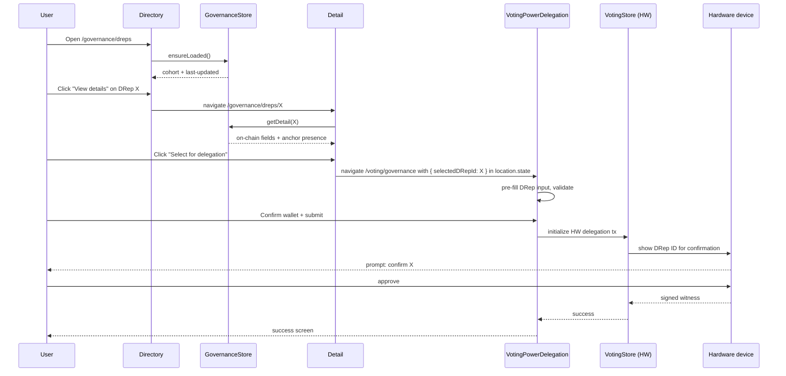

# DRep Discovery — Governance Section Via Renamed `Voting` Entry

**Paradigm:** Rename the existing `Voting` sidebar entry to `Governance` and expand that single section to cover the governance delegation form, DRep directory, DRep detail, Favorites, and existing Catalyst voting. Delegation handoff uses React Router `location.state` into the existing `/voting/governance` form. This is the locked design direction; see [README.md](./README.md) for rationale.

## Information Architecture

```mermaid
flowchart TD
  Nav[Sidebar: Governance (renamed from Voting)] --> Section[Governance section]
  Section --> Existing[/voting/governance]
  Section --> Dir[/governance/dreps]
  Section --> Detail[/governance/dreps/:drepId]
  Section --> Favs[/governance/favorites]
  Section --> Catalyst[Existing Catalyst voting]
  Dir -- Select for delegation --> Hand[Voting form pre-fill]
  Detail -- Select for delegation --> Hand
  Favs -- Select for delegation --> Hand
  Hand --> Existing
  Existing --> Confirm[Confirmation dialog]
  Confirm --> SW{Wallet type?}
  SW -- Software --> SwPwd[Spending password]
  SW -- Hardware --> HwDev[On-device confirm]
  SwPwd --> Submit[delegateVotes request]
  HwDev --> Submit2[VotingStore HW path]
```

New route literals (proposed for `routes-config.ts`):

```
GOVERNANCE: {
  ROOT: '/governance',
  DREPS: '/governance/dreps',
  DREP_DETAIL: '/governance/dreps/:drepId',
  FAVORITES: '/governance/favorites',
}
```

The existing `VOTING.GOVERNANCE = '/voting/governance'` route stays; the handoff is `history.push('/voting/governance', { selectedDRepId })` through React Router `location.state`. Query params and `VotingStore.pendingFormState` are explicitly out of scope.

**Sub-route defaults & active state:**
- `/governance` redirects to `/governance/dreps` (the Directory is the section landing page).
- The `Directory` tab is the active tab for **both** `/governance/dreps` and `/governance/dreps/:drepId` (detail view does not get its own tab).
- The `Favorites` tab is active only for `/governance/favorites`.

**Second entry point — "Browse DReps" from the delegation form.** In addition to the renamed sidebar entry, the existing `VotingPowerDelegation` form gains a secondary "Browse DReps" link/button next to the DRep ID input that navigates the user to `/governance/dreps`. This is the plan-mandated second entry affordance — users who land on the delegation form first should not have to learn a separate nav surface to discover the directory.

**Round-trip state preservation (binding).** Navigating out to `/governance/dreps` from `VotingPowerDelegation` preserves the form's currently-selected wallet and vote-type in React Router `location.state`, for example `history.push('/governance/dreps', { from: '/voting/governance', selectedWalletId, voteType })`. The directory/detail/favorites surfaces pass the same state back, plus `selectedDRepId`, when they navigate to `/voting/governance`. `VotingStore.pendingFormState` and query params are not used. Tests must cover wallet + vote-type restoration end-to-end.

For the two-hop sequence (Form → Directory → Detail → Form): the Directory passes state to Detail when pushing `/governance/dreps/:drepId`. Detail's "Select for delegation" combines the inherited state with `selectedDRepId` before pushing `/voting/governance`. Tests must cover wallet + vote-type restoration through both hops.

## Wireframes

### Directory route `/governance/dreps`

```
┌─ Sidebar ──┬─ Header: Governance ──────────────────────────────┐
│ Wallets    │  Directory  |  Favorites                          │
│ Staking    ├──────────────────────────────────────────────────┤
│► Governance│  [🔄 Refresh] Last updated 3 min ago              │
│ Settings   │  ╭──────────────────────────────────────────────╮ │
│            │  │ ⓘ Default view shows up to 200 eligible      │ │
│            │  │   DReps in randomized order, excluding the   │ │
│            │  │   35 largest. [Show all] · [Reshuffle]       │ │
│            │  ╰──────────────────────────────────────────────╯ │
│            │  [Search DReps by ID…]            [Filters ▾ (1)] │
│            │  ┌───────────────────────────────────────────────┐│
│            │  │ ☆ │ ●Active │ DRep ID drep1yg7s…aj8ras  📋   ││
│            │  │   │         │ Voting power: ₳ 688K  (on-chain)││
│            │  │   │         │ [View details]  [Select]       ││
│            │  └───────────────────────────────────────────────┘│
│            │  …repeat…                                          │
│            │  ◀  page 1 of 8  ▶                                │
└────────────┴────────────────────────────────────────────────────┘
```

The directory list is paginated at **25 cards per page**. Total page count derives from the filtered cohort size (e.g., 8 pages for a 200-DRep default cohort).

### Detail route `/governance/dreps/:drepId`

```
┌─ Governance > DRep detail ────────────────────────────────────┐
│ [← Back to directory]                                          │
│                                                                │
│ {default avatar} drep1yg7s…aj8ras  📋    ☆ Favorite           │
│ (CIP-105) drep185r8rr6j9evjs…uutaz3  📋                       │
│                                                                │
│ ┌── On-chain ──────────────────────────────────────────────┐  │
│ │ Status:        ● Active                                  │  │
│ │ Expires in:    34 epochs                                 │  │
│ │ Voting power:  ₳ 688,964.12                              │  │
│ │                (688,964,123,456 lovelace)                │  │
│ │ Registered:    epoch 502                                 │  │
│ │ Current votes: 2 Yes · 1 No · 0 Abstain (this epoch)     │  │
│ └──────────────────────────────────────────────────────────┘  │
│                                                                │
│ ┌── Anchor ────────────────────────────────────────────────┐  │
│ │ Anchor URL:    https://example.org/drep.json   (present) │  │
│ │ Anchor digest: b5e2…f3a1                                 │  │
│ │ Status:        Unverified anchor (anchor-1 will fetch    │  │
│ │                and verify off-chain profile)             │  │
│ └──────────────────────────────────────────────────────────┘  │
│                                                                │
│ [Select for delegation]                                        │
└────────────────────────────────────────────────────────────────┘
```

### Favorites route `/governance/favorites`

Same card layout as Directory, but cohort banner replaced with: `"{n} DReps you've favorited. Favorites are stored on this device only."` Empty state: prominent illustration + copy + CTA back to Directory.

**Stale favorites.** If a favorited DRep becomes Retired or appears with `doNotList=true` after `anchor-2` lands, it remains in the favorites list with its current `Retired` or `Excluded from default cohort` status badge (shared tokens §1) and an inline caption: `governance.drepFavorites.staleCaption` → *"This DRep is no longer in the default cohort."* No automatic removal. The user unfavorites explicitly.

## Interaction Sequence (HW Wallet Happy Path)



## Component Hierarchy

Following existing convention (`source/renderer/app/components/<area>/<sub>/`):

```
components/voting/voting-governance/
  VotingPowerDelegation.tsx              ← *modify existing*: add "Browse DReps" link/button next to DRep ID input, wire to /governance/dreps with `location.state` preservation per IA section above

components/governance/
  layouts/
    GovernanceWithNavigation.tsx          ← analog of StakingWithNavigation
    GovernanceWithNavigation.scss
  drep-directory/
    DRepDirectory.tsx                     ← page container
    DRepDirectory.scss
    DRepDirectoryBanner.tsx               ← randomization + show-all banner
    DRepDirectoryFilters.tsx              ← filter dropdown
    DRepDirectorySearch.tsx
    DRepDirectoryList.tsx                 ← card list (mobile/dense)
    DRepDirectoryTable.tsx                ← table view (large screens, parity w/ StakePoolsTable)
    DRepCard.tsx                          ← single result, used by list + favorites
    DRepCard.scss
    DRepStatusBadge.tsx                   ← per shared tokens §1
    DRepCategoryBadge.tsx                 ← per shared tokens §1a (High value / Primary / Threshold / Non-metadata)
    DRepSourceLabel.tsx                   ← per shared tokens §2
    DRepIdDisplay.tsx                     ← dual-ID + copy
    DRepRefreshIndicator.tsx              ← last-updated + spinner
    helpers.ts                            ← filter/sort helpers analog to stake-pools/helpers.ts
  drep-detail/
    DRepDetail.tsx
    DRepDetail.scss
    DRepDetailOnchainSection.tsx
    DRepDetailAnchorSection.tsx           ← shows "unverified anchor" in slice-4; verified content in anchor-1
    DRepDetailActions.tsx                 ← favorite + select-for-delegation
  drep-favorites/
    DRepFavorites.tsx
    DRepFavorites.scss
    DRepFavoritesEmptyState.tsx
  shared/
    DRepEmptyState.tsx                    ← noResults | selfnode | noSync variants
    DRepErrorBanner.tsx                   ← refresh failed | ranking unavailable
```

Container components (MobX `@observer`) live under `containers/governance/` mirroring the per-page structure.

## State / Empty / Loading / Error Treatments

| Scenario | Treatment |
|---|---|
| First load, no cached data | Full skeleton list, banner visible, refresh button disabled |
| First load completed, default cohort | List rendered, banner visible, "Last updated just now" |
| Refresh in flight, cached data present | Spinner badge next to timestamp, list still interactive |
| Refresh failed (timeout/parse) | `DRepErrorBanner` at top; cached list still shown; explicit retry |
| Ranking unavailable | List shown, voting-power column `—`, banner with `error.rankingUnavailable` |
| Selfnode CLI unsupported | Replace list area with `DRepEmptyState selfnode` |
| Node syncing | Replace list area with `DRepEmptyState noSync` |
| No filter results | List area shows `DRepEmptyState noResults` with `Clear filters` and `Show all` actions |
| Favorites empty | `DRepFavoritesEmptyState` with CTA back to Directory |
| DRep detail load failure | Inline error in main pane; "Back to directory" link |

## Anchor Source-Labelling Treatment (anchor-1-ready)

`DRepDetailAnchorSection` always rendered. In slice-4 it shows only:

- Anchor URL (raw, no fetch)
- Anchor digest (truncated, copy button)
- Status badge: `Unverified anchor` (per shared tokens §2)

In anchor-1 (givenName) and anchor-2 (remaining fields), after `GovernanceQueryService` + anchor fetch verify the content, the section adds a child `DRepDetailAnchorContent` rendering `givenName`, `image`, `objectives`, `motivations`, `qualifications`, `references[Link|Identity]`, `paymentAddress`. Each rendered field carries the `Verified off-chain content` label. `DRepCard` does **not** render verified anchor content even after anchor-1/anchor-2 (cards stay on-chain-only) — the verified enrichment surfaces in detail and favorites only.

## Default-Cohort UX

- Banner copy (shared tokens §5) is sticky at the top of the directory list, including the Beyond MVG (BMVG) Simplified attribution as the secondary line.
- The default cohort IS the "Recommended" sort for this release. No separate Recommended tab and no per-card Recommended badge ship in Phase 1; the four-category badge (shared tokens §1a) is the per-DRep explanation surface.
- Default cohort eligibility hard floor: `drep-state` active AND remaining `drepActivity` > 6 epochs. Mock fixtures that surface "Expiring in 3 epochs" cards inside the default cohort are fixture-only — production renders MUST respect the 6-epoch floor. The "Expiring in {n} epochs" status badge from shared tokens §1 only fires for the 6–12 epoch window (Threshold category) or for entries surfaced via search / show-all that fall below the floor.
- "Excluded from default cohort" badge appears on any top-35 DRep when it surfaces via search or show-all.
- Default cohort is randomized; the seed is held in `GovernanceStore` and persists for the app session. "Reshuffle" reseeds without re-querying.
- Filtering or searching switches the banner copy to remove the randomization claim.

## Filter / Search — Show-All Without Re-introducing Bias

`Show all` toggles the cohort to "all eligible + top-35". When `Show all` is active, sort options become available (default still `randomized`; user can pick `voting power desc`, `voting power asc`, `expiry asc`). Sort is opt-in only; the user must make an explicit choice. This preserves anti-bias intent while letting power users find specific large DReps.

**Popularity-sort guardrail.** When the user activates the `voting power desc` sort under Show-all, an inline disclosure appears directly above the list (message ID `governance.drepDirectory.showAll.sortBiasWarning`):

> "Sorted by voting power. Default randomized order is designed to reduce popularity bias — consider returning to default for unbiased browsing."

The disclosure dismisses with the same user action that returns to default sort. Dismissal is not persisted — re-activating `voting power desc` shows it again.

Search is always available regardless of cohort and applies fuzzy match on DRep ID prefix only in v1 (slice-6). Verified `givenName` search is deferred until a bulk cohort anchor-prefetch phase populates names for the whole directory; per-DRep lazy anchor fetch (anchor-1) does not make names searchable across unvisited DReps. Search results are sorted by relevance only.

## Hardware Wallet Confirmation

Handed off to existing `VotingPowerDelegation` confirmation. This direction adds nothing new to the HW flow; it inherits everything from shared tokens §7 (identity equality rule — CIP-129 + CIP-105 + signed payload all byte-equal) and §8 (HW sub-states). After a successful delegation, the user lands back on the voting confirmation screen; from there a `View DRep in directory` link returns to `/governance/dreps/:drepId` to inspect ongoing state.

## Accessibility

- `GovernanceWithNavigation` mirrors `StakingWithNavigation` keyboard pattern: arrow keys cycle sub-nav, `Enter` activates.
- Directory list: each card is a `<article>` with `role="group"` and ARIA label "{drepId}, {status}, voting power {amount}".
- Banner is a `<section aria-labelledby="cohort-heading">` with a visually hidden heading so SR users get explicit context.
- Focus management on detail navigation: focus moves to the back-link, then primary heading.
- All status/source visual cues are paired with icon + text (color is decorative).

## Pros / Cons / Risks

**Pros**
- Cleanest IA for future governance surfaces (proposals, constitution, dashboard) without introducing a second governance sidebar destination.
- Each sub-surface gets its own URL → deep-link from notifications/docs is natural.
- Largest screen real estate for detail → best fit for anchor-1/anchor-2 verified anchor content.

**Cons**
- Renames an existing sidebar entry, so established `Voting` muscle memory shifts.
- Most i18n surface area (three pages + nav label).

**Risks**
- Sidebar label rename requires walkthrough, localization, and snapshot updates across the existing voting/governance surface.
- Governance now spans the legacy `/voting/governance` delegation route and the `/governance/*` browse routes, so the `location.state` round-trip contract is release-critical.

## Implementation Effort Delta vs Foundation Baseline

Tasks referenced: task-107 (bare directory components), task-116 (detail), task-112 (selector integration), task-117 (detail route) / nav wiring in slice-1.

| Δ | Reason |
|---|---|
| +4–6h | `GovernanceWithNavigation` layout container + tests |
| +1–2h | Rename existing sidebar entry + active-state logic + a11y |
| +3–4h | Three sub-routes wiring + `location.state` round-trip preservation |
| +1–2h | Extra i18n IDs (nav label, page titles, breadcrumbs) |
| **Total ~9–14h on top of baseline** | |
