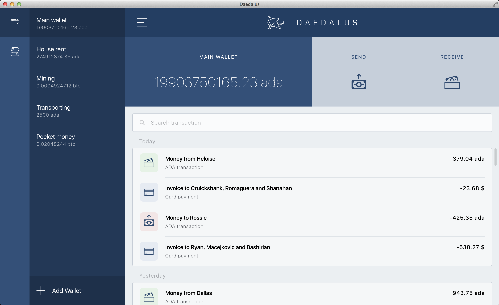
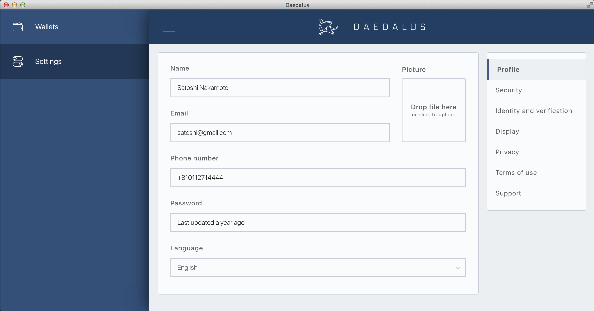
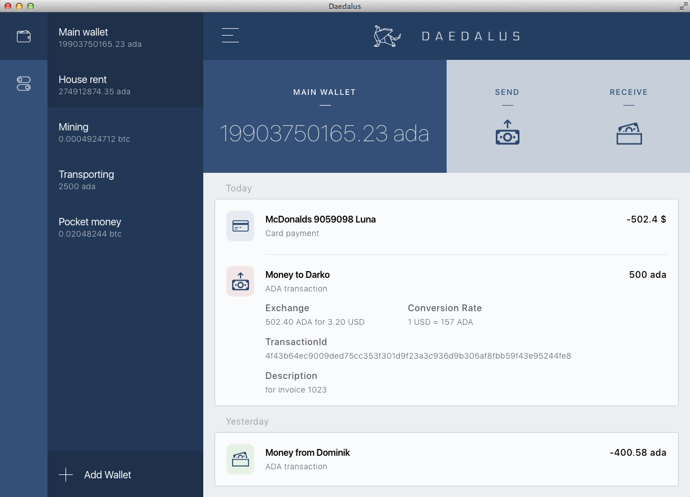

Changelog
=========

## vNext
=======

### Features

- Added support for configurable Api port ([PR 992](https://github.com/input-output-hk/daedalus/pull/992))
- Added initial configuration for a testnet build of Daedalus ([PR 991](https://github.com/input-output-hk/daedalus/pull/991))

### Fixes

- Improved paper wallet certificate QR code compatibility ([PR 999](https://github.com/input-output-hk/daedalus/pull/999))
- Fixed a bug in the Electron which results in blank/white screen rendering on some OS/Graphics-card/Drivers combinations.  ([PR 1007](https://github.com/input-output-hk/daedalus/pull/1007))

### Chores

- Improved network label in the Top bar ([PR 988](https://github.com/input-output-hk/daedalus/pull/988))

## 0.11.0

### Features

- Implemented a switch instead of a link for "hide used" addresses on the Receive screen ([PR 935](https://github.com/input-output-hk/daedalus/pull/935))
- Added a notification for Windows users that using antivirus software might slow down wallet 
  restoration ([PR 1020](https://github.com/input-output-hk/daedalus/pull/1020))

### Fixes

- Disabled dragging of static UI images elements ([PR 910](https://github.com/input-output-hk/daedalus/pull/910))
- Disabled webview tags to prevent XSS attacks ([PR 946](https://github.com/input-output-hk/daedalus/pull/946))
- Fixed 633 npm audit issues by upgrading dependencies ([PR 944](https://github.com/input-output-hk/daedalus/pull/944))
- Fixed a bug related to rendering of transactions with duplicated IDs ([PR 947](https://github.com/input-output-hk/daedalus/pull/947))
- Fixed broken translation on create wallet dialog ([PR 930](https://github.com/input-output-hk/daedalus/pull/930))
- Fixed huge build file sizes ([PR 886](https://github.com/input-output-hk/daedalus/pull/886))
- Fixed Linux Kanji characters support ([PR 971](https://github.com/input-output-hk/daedalus/pull/971))
- Fixed Storybook configuration issues ([PR 928](https://github.com/input-output-hk/daedalus/pull/928))
- Fixed text wrapping within wallet navigation tabs ([PR 911](https://github.com/input-output-hk/daedalus/pull/911))
- Reduced resource usage ([PR 886](https://github.com/input-output-hk/daedalus/pull/886))
- Refactored about window to normal UI dialog to save resources ([PR 965](https://github.com/input-output-hk/daedalus/pull/965))
- Removed mocked ETC wallet data injection in Cardano Daedalus builds ([PR 955](https://github.com/input-output-hk/daedalus/pull/955))
- Removed the Ada Redemption link from the "app bar" menu and added it to system menu ([PR 972](https://github.com/input-output-hk/daedalus/pull/972))

### Chores

- Added "Author" and "Status" information to all Daedalus README files ([PR 901](https://github.com/input-output-hk/daedalus/pull/901))
- Added acceptance tests for displaying transactions in various contexts ([PR 870](https://github.com/input-output-hk/daedalus/pull/870))
- Added acceptance tests for hide/show used addresses feature ([PR 957](https://github.com/input-output-hk/daedalus/pull/957))
- Added flow checks and linting for storybook code ([PR 938](https://github.com/input-output-hk/daedalus/pull/938))
- Added PR template with PR review checlist ([PR 882](https://github.com/input-output-hk/daedalus/pull/882))
- Fixed wallet restoration and import fragile acceptance tests steps definitions ([PR 885](https://github.com/input-output-hk/daedalus/pull/885))
- Improved re-build times with caching ([PR 915](https://github.com/input-output-hk/daedalus/pull/915))
- Improved request body length calculation ([PR 892](https://github.com/input-output-hk/daedalus/pull/892))
- Improved text display by reducing letter-spacing ([PR 973](https://github.com/input-output-hk/daedalus/pull/973))
- Log expected errors as debug messages only ([PR 916](https://github.com/input-output-hk/daedalus/pull/916))
- Refactored npm scripts to use colon style ([PR 939](https://github.com/input-output-hk/daedalus/pull/939))
- Refactored various magic numbers & strings into constants ([PR 881](https://github.com/input-output-hk/daedalus/pull/881))

## 0.10.1
=======

### Fixes

- Fixed issues with printing paper wallet certificate PDFs on printers with low amount of memory by replacing the SVG assets with transparent PNG images ([PR 951](https://github.com/input-output-hk/daedalus/pull/951))
- Fixed presentation bug that caused only ten wallets to be shown in the wallets list, even though there were more than ten wallets in the application ([PR 958](https://github.com/input-output-hk/daedalus/pull/958))
- Fixed reporting server URL used for submitting support requests for the Linux build of Daedalus ([PR 959](https://github.com/input-output-hk/daedalus/pull/959))
- Fixed missing launcher log file ([PR 963](https://github.com/input-output-hk/daedalus/pull/963))
- Fixed issue with multiple cardano-node processes running and windows allowing skipping of files in installer ([PR 953](https://github.com/input-output-hk/daedalus/pull/953))
- Limit maximum number of wallets to 20 ([PR 966](https://github.com/input-output-hk/daedalus/pull/966))

## 0.10.0
=======

### Features

- Asynchronous wallet restoration ([PR 849](https://github.com/input-output-hk/daedalus/pull/849))
- Added wallet restore indicator in the sidebar ([PR 862](https://github.com/input-output-hk/daedalus/pull/862))
- Added Daedalus version in application title ([PR 826](https://github.com/input-output-hk/daedalus/pull/826))
- Added "Show more transactions" button on the summary screen ([PR 848](https://github.com/input-output-hk/daedalus/pull/848))
- Added "Recovery - regular" and "Recovery - force vended" tabs on "Ada redemption" screen ([PR 933](https://github.com/input-output-hk/daedalus/pull/933))
- Setting spending password to "ON" by default ([PR 856](https://github.com/input-output-hk/daedalus/pull/856))
- Paper wallet certificate generation ([PR 779](https://github.com/input-output-hk/daedalus/pull/779))
- Paper wallet certificate restoration ([PR 794](https://github.com/input-output-hk/daedalus/pull/794))
- Update paper wallet certificate generation to use more random bits ([PR 871](https://github.com/input-output-hk/daedalus/pull/871))

### Fixes

- Fixed color of ADA logo color on the loading screen (logo was too transparent) ([PR 850](https://github.com/input-output-hk/daedalus/pull/850))
- Fixed styling of "click to upload" text on Ada redemption screen (text was too bold) ([PR 850](https://github.com/input-output-hk/daedalus/pull/850))
- Fixed node syncing state bubble background color in Dark blue theme ([PR 850](https://github.com/input-output-hk/daedalus/pull/850))
- Fixed cropped log list within the support request dialog ([PR 850](https://github.com/input-output-hk/daedalus/pull/850))
- Fixed submit button flicker within the support request dialog ([PR 850](https://github.com/input-output-hk/daedalus/pull/850))
- Fixed "Download logs" button bug where it would throw Javascript error in case user does not select destination directory for saving logs file ([PR 850](https://github.com/input-output-hk/daedalus/pull/850))
- Updated moment.js dependency to the latest version which fixes ReDOS vulnerability ([PR 782](https://github.com/input-output-hk/daedalus/pull/782))
- Updated Electron dependency to the latest version which fixes vulnerability issues ([PR 855](https://github.com/input-output-hk/daedalus/pull/855))
- Extended About dialog size in order to display increased team members list ([PR 880](https://github.com/input-output-hk/daedalus/pull/880))
- Created screen for Ada redemption in case there are no wallets ([PR 970](https://github.com/input-output-hk/daedalus/pull/970))

### Chores

- Improved build system ([PR 692](https://github.com/input-output-hk/daedalus/pull/692))
- Added instructions for accessing FAQ, reporting a problem and downloading logs on the support page in general settings ([PR 818](https://github.com/input-output-hk/daedalus/pull/818))
- Removed sending logs to remote server feature ([PR 818](https://github.com/input-output-hk/daedalus/pull/818))
- Improved support dialog by default switching the "Attach logs" switch to active ([PR 829](https://github.com/input-output-hk/daedalus/pull/829))
- Improved support dialog logs list (logs are now alphabetically ordered) ([PR 828](https://github.com/input-output-hk/daedalus/pull/828))
- Improved manual bug report submission dialog text color in Dark blue theme ([PR 824](https://github.com/input-output-hk/daedalus/pull/824))
- Improved transaction element addresses: addresses and hashes now act like linkes to Cardano Explorer ([PR 850](https://github.com/input-output-hk/daedalus/pull/850))
- Improved transaction element toggling: click on the white areas should collapse view (not only click on the top part) ([PR 850](https://github.com/input-output-hk/daedalus/pull/850))
- Improved transaction element transaction state handling: transaction with 0 confirmations is now shown in pending state ([PR 825](https://github.com/input-output-hk/daedalus/pull/825))
- Improved wallet creation dialogs handling: clicking outside of the dialogs should not close them ([PR 832](https://github.com/input-output-hk/daedalus/pull/832))
- Improved Dark blue theme styling of update and restoration notifications ([PR 827](https://github.com/input-output-hk/daedalus/pull/827))
- Improved About dialog (team members are updated and alphabetically ordered) ([PR 830](https://github.com/input-output-hk/daedalus/pull/830))
- Improved copy icons visibility on Receive screen ([PR 850](https://github.com/input-output-hk/daedalus/pull/850))
- Improved error message on the NTP time synchronisation error screen ([PR 852](https://github.com/input-output-hk/daedalus/pull/852))
- Improved Loading screen timeouts logic ([PR 860](https://github.com/input-output-hk/daedalus/pull/860))
- Updated sidebar bug icon action to open Settings Support page instead of Support Request dialog ([PR 858](https://github.com/input-output-hk/daedalus/pull/858))
- Updated the way parallel restore/imports are explaned to the user by disabling the restore/import buttons on the Add wallet dialog and presenting a user friendly message ([PR 861](https://github.com/input-output-hk/daedalus/pull/861))
- Updated main and acceptance tests readme files with new acceptance tests setup information ([PR 831](https://github.com/input-output-hk/daedalus/pull/831))
- Paper wallet certificate generation and wallet restoration from a paper wallet certificate acceptance tests ([PR 807](https://github.com/input-output-hk/daedalus/pull/807))
- Use UTC time in Daedalus logs ([PR 833](https://github.com/input-output-hk/daedalus/pull/833))
- Disabled text selection on static UI elements ([PR 868](https://github.com/input-output-hk/daedalus/pull/868))
- Updated Daedalus and Cardano team members on the about dialog ([PR 872](https://github.com/input-output-hk/daedalus/pull/872))

## 0.9.1
=======

### Features
- New Edit section in system menu with copy & paste and related actions ([PR 817](https://github.com/input-output-hk/daedalus/pull/817))

### Fixes

- A presentation bug has been fixed that caused only five recent transactions to be shown on the transaction list, even though there were more than five transactions in the wallet. ([PR 778](https://github.com/input-output-hk/daedalus/pull/778))
- An issue has been fixed that stopped copy and paste operations from working when initiated using the right-click context menu. ([PR 817](https://github.com/input-output-hk/daedalus/pull/817))
- On Windows, the desktop icon was not showing the Daedalus image; this has now been fixed. ([837](https://github.com/input-output-hk/daedalus/pull/837))
- An error has been fixed that in some cases prevented users creating a wallet with a name containing non-latin characters, like Japanese Kanji or Chinese. ([PR 840](https://github.com/input-output-hk/daedalus/pull/840))

## 0.9.0
=======

### Features

- Do not block the UI while wallet is being restored/imported ([PR 457](https://github.com/input-output-hk/daedalus/pull/457))
- Start and stop Mantis Client from Daedalus main process ([PR 568](https://github.com/input-output-hk/daedalus/pull/568))
- Add ADA and Mantis logo to loader screens ([PR 584](https://github.com/input-output-hk/daedalus/pull/584))
- New Edit section in system menu with copy & paste and related actions ([PR 817](https://github.com/input-output-hk/daedalus/pull/817))

### Fixes

- Use correct Daedalus version in bug reports ([PR 948](https://github.com/input-output-hk/daedalus/pull/948))
- Fixed about dialog for ETC build ([PR 586](https://github.com/input-output-hk/daedalus/pull/586))
- Made `Light Blue` theme the default for ETC build ([PR 586](https://github.com/input-output-hk/daedalus/pull/586))
- Fixed a bug related to gas limit when sending transactions ([PR 586](https://github.com/input-output-hk/daedalus/pull/586))
- Remove transactions sorting ([PR 587](https://github.com/input-output-hk/daedalus/pull/587))
- Improve ETC transaction amount validation ([PR 590](https://github.com/input-output-hk/daedalus/pull/590))
- Fixed storybook and resolver issues ([PR 617](https://github.com/input-output-hk/daedalus/pull/617))
- Time of your machine is different from global time. You are 0 seconds behind. ([PR 678](https://github.com/input-output-hk/daedalus/pull/678))
- Updated copy for the sync error screen ([PR 657](https://github.com/input-output-hk/daedalus/pull/657))
- Detect when wallet is disconnected ([PR 689](https://github.com/input-output-hk/daedalus/pull/689))
- Improve connecting/reconnecting messages on Loading screen ([PR 696](https://github.com/input-output-hk/daedalus/pull/696))
- Send bug reports with logs from Daedalus ([PR 691](https://github.com/input-output-hk/daedalus/pull/691))
- Poll local time difference every 1 hour, only when connected ([PR 719](https://github.com/input-output-hk/daedalus/pull/719))
- Fixed various styling issues and updated to react-polymorph 0.6.2 ([PR 726](https://github.com/input-output-hk/daedalus/pull/726))
- Fixed async restore/import dialogs logic ([PR 735](https://github.com/input-output-hk/daedalus/pull/735))
- Fixed minor UI issue on receive screen when generating wallet addresses with spending password ([PR 738](https://github.com/input-output-hk/daedalus/pull/738))
- Fixed `Time sync error notification` not showing up in case blocks syncing has not started ([PR 752](https://github.com/input-output-hk/daedalus/pull/752))
- Properly wait for node update request ([PR 949](https://github.com/input-output-hk/daedalus/pull/949))

### Chores

- Update DLL package and cleanup translation files ([PR 566](https://github.com/input-output-hk/daedalus/pull/566))
- Replace electron-json-storage with electron-storage ([PR 579](https://github.com/input-output-hk/daedalus/pull/579))
- Update terms of use for ETC version ([PR 606](https://github.com/input-output-hk/daedalus/pull/606))
- Update Electron to version 1.7.11 which resolves security issues ([PR 677](https://github.com/input-output-hk/daedalus/pull/677))
- Document Cardano SL build ([PR 654](https://github.com/input-output-hk/daedalus/pull/654))
- Update about dialog content ([PR 680](https://github.com/input-output-hk/daedalus/pull/680))
- Ada redemption tests modified to run in mainnet mode ([PR 681](https://github.com/input-output-hk/daedalus/pull/681))
- Log file moved to public folder and Electron crash reporter removed ([PR 682](https://github.com/input-output-hk/daedalus/pull/682))

## 0.8.3
=======

### Fixes

- Improved messages for update notifications ([PR 526](https://github.com/input-output-hk/daedalus/pull/526))

## 0.8.2
=======

### Features

- Postpone Update Api call integration ([PR 485](https://github.com/input-output-hk/daedalus/pull/485))
- Wallet restore recovery phrase textarea replaced with React-Polymorph Autocomplete ([PR 516](https://github.com/input-output-hk/daedalus/pull/516))
- Instructions for setting up NTP on Daedalus website ([PR 531](https://github.com/input-output-hk/daedalus/pull/531))

### Fixes

- Fix error message text for A to A transaction error ([PR 484](https://github.com/input-output-hk/daedalus/pull/484))
- Fix "label prop type" checkbox issue in react-polymorph ([PR 487](https://github.com/input-output-hk/daedalus/pull/487))
- Remove all drag and drop instructions from UI ([PR 495](https://github.com/input-output-hk/daedalus/pull/495))
- Preferences saved to local storage prefixed with network ([PR 501](https://github.com/input-output-hk/daedalus/pull/501))
- Disable wallet import and export features for the mainnet ([PR 503](https://github.com/input-output-hk/daedalus/pull/503))
- Correctly prevent max-window-size in electron ([PR 532](https://github.com/input-output-hk/daedalus/pull/532))
- Make sure wallet import and restore in-progress notification is hidden once process is done ([PR 540](https://github.com/input-output-hk/daedalus/pull/540))
- Fix broken translation files loading ([PR 559](https://github.com/input-output-hk/daedalus/pull/559))
- Fix async wallet import/restore issues ([PR 562](https://github.com/input-output-hk/daedalus/pull/562))

### Chores

- Update version in About dialog to 0.8.2 ([PR 496](https://github.com/input-output-hk/daedalus/pull/496))
- Set Dark theme as default one for the mainnet ([PR 497](https://github.com/input-output-hk/daedalus/pull/497))
- JS-Api integration ([PR 525](https://github.com/input-output-hk/daedalus/pull/525))
- Only log errors to papertrail ([PR 509](https://github.com/input-output-hk/daedalus/pull/509))
- Update MobX React Form to latest version ([PR 533](https://github.com/input-output-hk/daedalus/pull/533))
- Update Electron, electron-devtools-installer, electron-packager and electron-rebuild to latest versions ([PR 541](https://github.com/input-output-hk/daedalus/pull/541))
- Update flow-bin to version `0.59.0` ([PR 544](https://github.com/input-output-hk/daedalus/pull/544))
- Cleanup and standardization of ETC Api calls ([PR 549](https://github.com/input-output-hk/daedalus/pull/549))
- Unused vendor dependencies cleanup and DLL file optimization ([PR 555](https://github.com/input-output-hk/daedalus/pull/555))
- Introduce `testReset` endpoint for ETC api ([PR 558](https://github.com/input-output-hk/daedalus/pull/558))
- Update acceptance tests suite dependencies ([PR 561](https://github.com/input-output-hk/daedalus/pull/561))
- Refactor Cardano type declarations to type folder ([PR 557](https://github.com/input-output-hk/daedalus/pull/557))

## 0.8.1

### Fixes

- Fix all features eslint warnings ([PR 468](https://github.com/input-output-hk/daedalus/pull/468))
- Fix for disabled buttons on dark-blue theme ([PR 473](https://github.com/input-output-hk/daedalus/pull/473))
- Remove maximum screen width and height in full-screen mode ([PR 472](https://github.com/input-output-hk/daedalus/pull/472))
- Fix "label click" dropdown issue in react-polymorph ([PR 479](https://github.com/input-output-hk/daedalus/pull/479))

## 0.8.0

### Features

- Opt-in mode for sending logs to the remote server
- Added support for Cmd+H hotkey shortcut for hiding application window on OSX ([PR 404](https://github.com/input-output-hk/daedalus/pull/404))
- Setup environment variable for testnet/mainnet mode ([PR 400](https://github.com/input-output-hk/daedalus/pull/400))
- Export wallet to file ([PR 426](https://github.com/input-output-hk/daedalus/pull/426))
- Add theming options in settings ([PR 370](https://github.com/input-output-hk/daedalus/pull/398))
- About page, available from the system menu ([PR 430](https://github.com/input-output-hk/daedalus/pull/430))
- Setup default themes for TN and MN and introduce new theme names ([PR 451](https://github.com/input-output-hk/daedalus/pull/451))
- Transaction fees UX improvements on wallet sent screen ([PR 449](https://github.com/input-output-hk/daedalus/pull/449))
- Acceptance tests for General Settings screens ([PR 466](https://github.com/input-output-hk/daedalus/pull/466))
- Simple confirmation dialog for sending money ([PR 481](https://github.com/input-output-hk/daedalus/pull/481))
- Japanese terms of use for the mainnet ([PR 486](https://github.com/input-output-hk/daedalus/pull/486))

### Fixes

- Implement MomentJs internationalization
- Also quit whole app when last window is closed on osx
- Daedalus and Cardano node update notification text messages change ([PR 392](https://github.com/input-output-hk/daedalus/pull/392))
- Fixed brittle acceptance test steps (wallet latest transaction amount check) ([PR 393](https://github.com/input-output-hk/daedalus/pull/393))
- Fixed Numeric component caret position bug on wallet send screen ([PR 394](https://github.com/input-output-hk/daedalus/pull/394))
- Fixed all design implementation issues ([PR 397](https://github.com/input-output-hk/daedalus/pull/397))
- Fixed eslint syntax warnings ([PR 403](https://github.com/input-output-hk/daedalus/pull/403))
- Fixed wallet spending password fields error messages positioning on wallet create/restore/import dialogs ([PR 407](https://github.com/input-output-hk/daedalus/pull/407))
- Fixed inline-editing success-messages on wallet settings screen ([PR 408](https://github.com/input-output-hk/daedalus/pull/408))
- Fixed dialogs cut-off content on smaller screens ([PR 370](https://github.com/input-output-hk/daedalus/pull/398))
- Fixed the issue of dialogs being closable while wallet import/creation/restoring is happening ([PR 393](https://github.com/input-output-hk/daedalus/pull/414))
- Fixed calculation and display of transaction assurance levels ([PR 390](https://github.com/input-output-hk/daedalus/pull/416))
- Fixes Transaction additional info showing/hiding affects all user's wallets ([PR 411](https://github.com/input-output-hk/daedalus/pull/411))
- Fixed promise handling for unmounted wallet send form [PR 412](https://github.com/input-output-hk/daedalus/pull/412)
- Fixes Transaction toggle issue on active wallet change ([PR 421](https://github.com/input-output-hk/daedalus/pull/421))
- Fixed missing 'used address' styling for default wallet address on wallet receive screen ([PR 422](https://github.com/input-output-hk/daedalus/pull/422))
- Terms of service for the mainnet ([PR 425](https://github.com/input-output-hk/daedalus/pull/425))
- Fixed failing acceptance tests ([PR 424](https://github.com/input-output-hk/daedalus/pull/424))
- Show correct error message on sending money to Ada redemption address ([PR 423](https://github.com/input-output-hk/daedalus/pull/423))
- Fixed ENOENT error on log file rotation ([PR 428](https://github.com/input-output-hk/daedalus/pull/428))
- Fixed logging error ([PR 431](https://github.com/input-output-hk/daedalus/pull/431))
- Add theming support on UI which was introduced after introduction of Theming feature ([PR 434](https://github.com/input-output-hk/daedalus/pull/434))
- Speed-up About page opening time ([PR 450](https://github.com/input-output-hk/daedalus/pull/450))
- Importing a wallet from a file updated-API integration ([PR 439](https://github.com/input-output-hk/daedalus/pull/439))
- Exporting a wallet updated-API integration ([PR 438](https://github.com/input-output-hk/daedalus/pull/438))
- Show correct error message for A -> A transaction error ([PR 441](https://github.com/input-output-hk/daedalus/pull/441))
- Improved QR code colors on wallet send screen for dark themes ([PR 448](https://github.com/input-output-hk/daedalus/pull/448))
- Fixed transaction fees flicker on wallet send screen form submit ([PR 456](https://github.com/input-output-hk/daedalus/pull/456))
- Fixed failing acceptance-tests ([PR 454](https://github.com/input-output-hk/daedalus/pull/454))
- Prevent application window auto focusing while running acceptance-tests ([PR 458](https://github.com/input-output-hk/daedalus/pull/458))
- Limit and validate wallet's name maximum length ([PR 465](https://github.com/input-output-hk/daedalus/pull/465))
- UI/UX fixes ([PR 476](https://github.com/input-output-hk/daedalus/pull/476))

### Chores

- Added readme file for running acceptance tests ([PR 395](https://github.com/input-output-hk/daedalus/pull/395))
- Improved webpack build performance ([PR 402](https://github.com/input-output-hk/daedalus/pull/402))
- Updated README file "Development - network options" section ([PR 410](https://github.com/input-output-hk/daedalus/pull/410))
- All CSS hardcoded values replaced with variables ([PR 370](https://github.com/input-output-hk/daedalus/pull/398))
- Implemented sync progress and payment requests with new JS api as first step to remove the purescript api ([PR 437](https://github.com/input-output-hk/daedalus/pull/437))
- Speed optimizations for page reloads while running tests by loading bundled up for one-time tests runs ([PR 448](https://github.com/input-output-hk/daedalus/pull/445))
- Optimized structure and naming of theming files ([PR 453](https://github.com/input-output-hk/daedalus/pull/453))
- Added testnet label, loaded from translations for release candidate ([PR 460](https://github.com/input-output-hk/daedalus/pull/460))

## 0.7.0

### Features

- Sidebar is no longer auto-hiding if application window is width is greater than 1150px
- When user opens or closes the sidebar using the hamburger icon it stays open or closed
- Optionally setting a password during wallet creation
- "Terms of use" screen on first application start
- Spending password on "Send money" form
- Optionally setting a password during wallet restore
- Ada redemption disclaimer
- "Terms of use" page in settings section
- Change wallet password dialog UX improvements
- New receive screen with support for HD wallets
- Wallet rename
- Multiple input and output addresses in transaction details
- Ada redemption acceptance tests
- Show BTC and ETC currencies as coming soon in create wallet dialog
- Remove currencies dropdown on create wallet dialog
- Spending password on wallet receive page
- Prepared UI dialogs for exporting paper wallets
- Prepared UI dialogs for importing paper wallets
- Spending password on "Import wallet" dialog
- Spending password on "Ada redemption" forms
- Acceptance test for "Restore wallet with and without spending password" feature
- Acceptance test for "Create wallet with spending password" feature
- Acceptance test for "Import wallet with/without spending password" feature
- Acceptance test for "Send money from a wallet with spending password" feature
- Acceptance test for "Generate wallet address" feature
- Acceptance test for "Wallet settings management" features
- Final version of Daedalus logo added on the loading screen
- Final version of Daedalus logo added in the top-bar
- Receive page design update
- UI for displaying transaction fees on wallet send screen
- Correct placeholder text for Ada redemption "Ada amount" input

### Fixes

- Verification of mnemonic recovery phrase during wallet backup is not working if it contains duplicate words
- Pending confirmation amounts split (incoming and outgoing)
- Prevent wallet send form reset on submit
- Prevent redemption key reset after unsuccessful redemption
- Ghost boxes on "Loading" screen
- Reset Ada redemption form values on page load and certificate add/remove events
- Prevent sidebar auto-hiding feature and always show submenus on wallets page load
- Apply grammatical fixes to redemption instructions
- Prevent sidebar visual glitch on sidebar open
- Added missing "Add wallet" button label translation key
- Prevent "Delete wallet" dialog from closing until deletion is over
- Improved error handling on "Set/Change wallet password" dialog
- Improved API response errors handling
- Update active wallet after wallet update actions
- Last generated address was not being reset when switching wallets and it was shown on the receive screen for the wrong wallet
- Improved API nextUpdate response errors handling
- Improved active wallet data refresh after wallet balance/settings change
- Fixed failing wallet add/restore/import acceptance tests
- Polling for wallet data and system update should be disabled while node is syncing with the blockchain
- Prevent syncing icon from being always stuck in syncing state by refactoring in-sync state calculation
- Acceptance test for "Sending money" feature should check receiver wallet's balance
- Improved spending password validation rules
- Improved acceptance tests for generating new addresses
- Removed temporary workaround for creating new accounts during wallet create and wallet restore
- Prevent React key duplicates in transaction from/to addresses lists
- Acceptance tests configuration fix for the timeouts
- Show more specific error messages on "Change password" dialog
- Update password fields placeholders to match latest designs
- Prevent selected wallet reset on "Ada redemption" screen on tab or certificate change
- Fixed sending amount maximum value validation
- Use correct styling for used addresses marking on wallet receive screen

### Chores

- Prevent logging of harmless error messages to the terminal
- Purge "translation/messages/app" as a part of npm dev script
- Use markdown for "Terms of use" content
- Added manually written Flow types for API responses
- Testnet version on the testnet label bumped from 0.3 to 0.5
- Replaced all React-Toolbox components with React-Polymorph ones ([PR 361](https://github.com/input-output-hk/daedalus/pull/361))
- Temporary workaround for missing Japanese translations for Terms of Use that allows users to accept them in English

## 0.6.2

### Features

- Ada redemption testnet disclaimer on Ada redemption pages

## 0.6.1

### Fixes

- Wallet name on the send screen was hardcoded in Japanese translation
- Button on the wallet send screen is too large
- Hamburger button" and wallet's name are present on the "Ada redemption" and "Settings" screens
- Ada redemption button is not enabled as soon as inputs are valid
- Prevent navigation on file drop event in the application window

### Chores

- Logging improved by stringifying API requests and responses being logged
- Added system information to logs: OS, OS version, CPU and total RAM information

## 0.6.0

### Features

- Ada redemption with certificate decryption and parsing to extract the redemption key
- Transaction assurance level with color coding for transactions and settings for a normal or strict mode
- Wallet settings page with wallet deletion and transaction assurance level settings
- User interface language option on application start and in settings with English and Japanese translations
- Ada amounts formatting with thousands separator for displaying and entering amounts
- Application header updated to show wallet name and amount of money in the wallet
- Copy wallet address to the clipboard with UI notification
- Testnet label
- Application level settings page with language choice option
- Wallet summary page
- Showing absolute percentage with two decimals on the blockchain sync page
- File logging and sending logs to Papertrail logging service without sensitive user data

### Fixes

- Toggling the application bar not working properly
- UI glitch when quickly typing in Ada amounts on the send money form
- "Add wallet" dialog does not disappear immediately after wallet creation
- Clearing correctly entered backup recovery phrase should not be possible
- Sidebar "randomly" closes/opens when navigating
- Ada redemption overlay should also cover the wallet navigation
- No transactions message is not vertically centered on Transactions page
- Transactions ordering
- Smaller UI improvements and fixes

## 0.5.0

### Features

- Infinite loading for transaction list, testable with "Main wallet"
- Simple transaction search by title
- Adding new personal wallet via sidebar menu
- Profile settings screen
- "No transactions" message for wallets with no transactions
- "No transactions found" message when transaction search returns no results
- Loading indicator on application startup

### Fixes

- Improved sidebar UX when there is no sub-menu
- Transaction icons updated to design specs
- Improved transaction list page styling
- Active input field styled to design specs

### Chores

- Fixed and improved first acceptance test, made api data configurable for future test cases

## 0.4.0

### Features

- Sidebar with "Wallets" and "Settings" categories and list of dummy wallets
- Switch between wallets via the sidebar
- Selected wallet is highlighted in sidebar
- New transactions list design
- Transactions are grouped by date
- Click on transaction title toggles the details

### Fixes

- Fixed many styling issues
- Improved font rendering

### Chores

- First version of the backend api
- Improved and simplified mobx state management

## 0.3.0

### Features

- Added wallet creation screen that appears when there is no wallet yet
- Updated to the latest design specs and refactor to
[react-toolbox](http://react-toolbox.com/) instead of
material-ui for the UI components. This gives us much better style
customization and theming options.
- Cleaned up the boilerplate app menus
- Added basic form validations using [mobx-react-form](https://github.com/foxhound87/mobx-react-form)
- Added i18n support with [react-intl](https://github.com/yahoo/react-intl)
- Added wallet send / receive / transactions screens
- Form submitting UX updated to the design specifications with introduction of button loading spinners
and support for submitting the form with enter key
- Added cut, copy & paste application menu items and keyboard shortcuts

### Fixes

- Fixed problems with the form validations
- Fixed the electron build process & ensured that it worked

### Chore

- Updated to react-router v4
- Testing setup with cucumber & spectron
